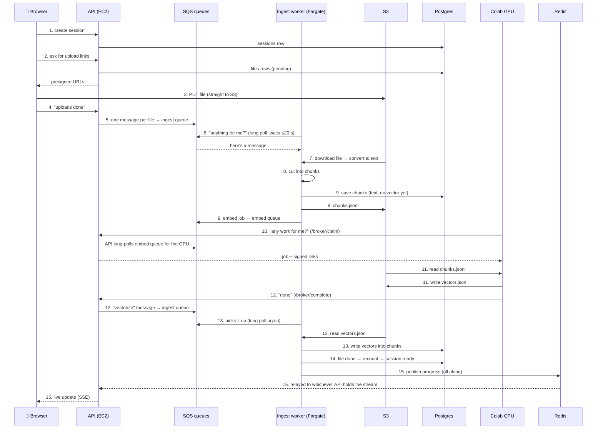

# Guide 1: Ingestion — how an uploaded file becomes searchable

> **Ingestion** = everything that happens between "user picks a file" and
> "the chat box unlocks". At the end, the file's text sits in Postgres as small
> pieces (chunks), each with a vector (a list of 384 numbers) that makes it
> searchable.

---

## The flow diagram



**Two things this diagram answers:**

- **Who puts messages in the queue?** Always a program that finished its part:
  - the API (step 5, step 12)
  - the ingest worker (step 9)
  - The GPU never touches a queue itself.
- **How does a worker know a message is there?** It doesn't get told. **It keeps asking.**
  - The worker calls SQS `ReceiveMessage` in a loop.
  - Each call waits up to 20 s and returns **the moment** a message arrives (long polling).
  - The GPU does the same thing with `/broker/claim`.

---

## The whole flow, one line per step

```
 1. Browser creates a session              → POST /sessions               (routes/sessions.py)
 2. Browser asks for upload links          → POST /sessions/{id}/uploads  (routes/uploads.py)
 3. Browser uploads the file straight to S3 → PUT <presigned url>          (frontend/src/api.js)
 4. Browser says "uploads done"            → POST .../files/register      (routes/uploads.py)
 5. API puts 1 message per file in queue   → SQS ingest queue             (shared/queues.py send_many)
 6. Ingest worker asks queue, gets message → long poll ReceiveMessage     (shared/worker.py)
 7. Worker turns the file into plain text  → Docling                      (shared/convert.py)
 8. Worker cuts the text into chunks       → 200 words each               (shared/chunking.py)
 9. Worker saves chunks + queues embed job → Postgres + S3 + embed queue  (workers/ingest/main.py)
10. GPU asks API "any work?", gets the job → POST /broker/claim           (routes/broker.py)
11. GPU turns chunks into vectors          → writes vectors.json to S3    (services/embedding/jobs.py)
12. GPU says "done", API queues next step  → /broker/complete → ingest q  (routes/broker.py)
13. Worker writes vectors into Postgres    → "vectorize" stage            (shared/vectorstore.py)
14. File marked done, session → ready      → recount of the files         (shared/bookkeeping.py)
15. Browser sees progress live (all along) → Redis pub/sub → SSE          (routes/events.py)
```

**Videos take a detour** between steps 6 and 8: the worker asks the GPU for a
transcript first. See 🎬 below.

**The three versions in one line each:**

- **v1:** one program on one server did everything in a background thread. Browser polled every 2 s.
- **v2:** queues and separate workers, but everything was still containers on **one EC2 box** with a SQLite file.
- **v3:** the same code shape as v2, spread across **managed AWS** (RDS, ElastiCache, Fargate, ALB), plus login, and vectors in Postgres.

---

## Step 1 — The browser creates a session

📍 **You are here:** `[Browser] ──▶ [API] ──▶ Postgres` · diagram arrow **1**

### 🟢 Newbie

- **What happens:** you click upload, and the browser first asks the API for a new "session", which is basically an empty folder with an id.
- **Which code:** `backend/api/routes/sessions.py` → `create_session()`
- **Why we need it:** every file and every chat message has to belong to something, and the session is that something.
- **What if we skip it:** files from different uploads (and different users) would get mixed together, and the chat couldn't tell which documents to search.
- **What you get:** a `session_id`, for example `3f2a…`. Every later step uses it.

### 🔧 Technical

- `POST /sessions` → inserts a `sessions` row with `status="created"` and `owner_id=<Cognito sub>`.
- `owner_id` comes from `require_user` (`shared/auth.py`), which verifies the Cognito ID token.
- From here on, every route checks `session.owner_id == caller`. If they don't match, the caller gets a 403.
- With Cognito not configured (local dev), `owner_id = "local-dev"`.

### 🔁 Compared with v2

- **What v2 did:** the same call, creating a session row, but with **no owner**. The `owner_id` column existed and was always empty. The row lived in a SQLite file on the one EC2 box.
- ✅ **v3 is better:**
  - **Privacy.** In v2, anyone who knew or guessed a session id could read that session. In v3 they get a 403.
  - **Durability.** The row is in RDS, which is backed up, so the session survives the server dying.
- ❌ **v3 costs more:**
  - You have to sign in first (Cognito), which is one more thing to set up and one more thing that can break.
  - Every request now does a token check. That's fast, but the first one fetches Cognito's keys over the network.

### ⏪ Compared with v1

- **What v1 did:** the same single insert, as a plain `def` (not `async`), into a SQLite file next to the code. There was no login, and the docstring says so: *"Nothing verifies it."*
- ✅ **v3 is better:** everything in the v2 list above, plus the API is `async`, so one server can hold many waiting requests at once.
- ❌ **v3 is worse:**
  - v1 ran on a laptop with `pip install` and nothing else.
  - v3 needs Postgres, Redis and Cognito before this one line is really working. For learning, v1 is far easier to follow.

---

## Step 2 — The browser asks for upload links

📍 **You are here:** `[Browser] ──▶ [API] ──▶ Postgres, then signed links ──▶ Browser` · diagram arrow **2**

### 🟢 Newbie

- **What happens:** the browser tells the API "I want to upload `report.pdf`, 3 MB". The API answers with a special one-time link.
- **Which code:** `backend/api/routes/uploads.py` → `create_uploads()`
- **Why we need it:** the file will go **directly to S3** (AWS file storage), not through our API. S3 only accepts it if the link is signed.
- **What if we skip it:** the only other option is sending the file through the API. A 2 GB video would then tie up the API server for minutes, and the API has one rule: never do slow work.
- **What you get:** one upload link per file, plus a `file_id` for each.

### 🔧 Technical

- Validates the size (`max_upload_bytes`, 2 GiB) and the extension (`convert.kind_for_filename`: pdf, docx, text, or video).
- Inserts one `files` row per file with `status="pending"` and `raw_key = sessions/{sid}/raw/{fid}/{name}`.
- `storage.presign_put(key, content_type)` creates the presigned URLs, all at once via `asyncio.gather`.
- The `Content-Type` is part of the signature. If the browser sends a different one, S3 returns a 403.

### 🔁 Compared with v2

- **What v2 did:** almost the same, with presigned S3 links and a 2 GiB size limit. It signed the links **one at a time** and didn't check who owned the session.
- ✅ **v3 is better:**
  - An **ownership check**, so you can't create uploads in someone else's session.
  - The links are signed **in parallel** (`asyncio.gather`), so 50 files come back faster.
- ❌ **v3 is worse:** nothing really. This step barely changed. The design was already right in v2.

### ⏪ Compared with v1

- **What v1 did:** the same idea behind a switch (`STORAGE_BACKEND`):
  - **local mode:** the "upload link" pointed back at **the API itself** (`/_storage/...`). The whole file went through the API and was read into memory (`await request.body()`).
  - **S3 mode** (on EC2): a real presigned S3 link, like today.
- ✅ **v3 is better:**
  - **A size limit** (v1 had none), so a 50 GB upload is refused up front.
  - **An ownership check.**
  - It is **always** S3, so the file bytes never touch the API. In v1's local mode, a 2 GB video could run the API out of memory.
- ❌ **v3 is worse:**
  - v1's local mode needed **no AWS account at all**, since files just went to a folder.
  - v3 needs a real S3 bucket with CORS set up even on your laptop, so there's more setup before your first upload.

---

## Step 3 — The browser uploads the file straight to S3

📍 **You are here:** `[Browser] ──────────────▶ [S3]` (the API is not involved) · diagram arrow **3**

### 🟢 Newbie

- **What happens:** the browser sends the file bytes to the link from step 2. The progress bar you see comes from this step.
- **Which code:** `frontend/src/api.js` → `uploadToStorage()`
- **Why we need it:** this is how the file actually gets stored.
- **What if we skip it:** the file never reaches AWS, and every later step fails with "file not found".
- **What you get:** your file sits in the S3 bucket at `sessions/<session>/raw/<file>/report.pdf`.

### 🔧 Technical

- Uses XHR `PUT` rather than `fetch`, because only XHR reports upload progress.
- **No `Authorization` header** is sent here. It isn't part of what S3 signed, so adding it breaks the upload.
- The bucket needs a **CORS rule** allowing `PUT` + `Content-Type`. Without it, the browser blocks the upload.

### 🔁 Compared with v2

- **What v2 did:** exactly the same, a browser `PUT` straight to S3.
- ✅ **v3 is better:** nothing changed in this step.
- ❌ **v3 is worse:** nothing. (The S3 bucket is new, in the new account, so its CORS rule had to be set up again.)

### ⏪ Compared with v1

- **What v1 did:**
  - **On EC2:** the same S3 `PUT`.
  - **On a laptop:** a `PUT` to the API's own `/_storage/` route, which **had no authentication**. Anyone who could reach the laptop could write files.
- ✅ **v3 is better:** there's no unauthenticated write route, and the API never holds file bytes.
- ❌ **v3 is worse:** you can't try it offline. v1 worked with no internet and no AWS.

---

## Step 4 — The browser says "uploads done"

📍 **You are here:** `[Browser] ──▶ [API]` · diagram arrow **4**

### 🟢 Newbie

- **What happens:** once every file has uploaded, the browser tells the API "all done, please start processing".
- **Which code:** `backend/api/routes/uploads.py` → `register_files()`
- **Why we need it:** the API can't see when an upload to S3 finishes. The browser has to say so.
- **What if we skip it:** the files sit in S3 forever and nobody ever processes them.
- **What you get:** the session switches to `processing`, with `files_total = N`.

### 🔧 Technical

- Checks that **every** `file_id` belongs to this session. If any doesn't, it returns 400, and nothing is dropped silently.
- Sets `session.status="processing"`, `files_total=N`, `files_done=0`, then commits.
- **The API still trusts the browser here.** It doesn't check that the file is really in S3. If it's missing, the worker fails in step 7 and retries.

### 🔁 Compared with v2

- **What v2 did:** the same, except that when some ids matched and some didn't, it **quietly processed only the matching ones**.
- ✅ **v3 is better:** a mismatch is now a clear error instead of "I uploaded 5 files and only 3 got processed".
- ❌ **v3 is worse:** nothing.

### ⏪ Compared with v1

- **What v1 did:** set the status to `processing` and didn't check the file ids at all. It also didn't record `files_total`.
- ✅ **v3 is better:**
  - It validates the ids.
  - It records `files_total`, which step 14 needs to know when *all* files are done.
- ❌ **v3 is worse:** nothing for this step.

---

## Step 5 — The API puts one message per file into the queue  *(who fills the queue)*

📍 **You are here:** `[API] ──▶ [SQS ingest queue]` · diagram arrow **5**

### 🟢 Newbie

- **What happens:** still inside the same "uploads done" call, the API writes one **note** per file ("please process file X of session Y") into a to-do list called the **ingest queue**. Then it answers the browser right away.
- **Which code:** `register_files()` → `shared/queues.py` → `send_many()`
- **Why a queue?** The API never does slow work. It hands the job to someone else and moves on.
  - If the worker crashes, the note is **not lost**: it comes back and someone else takes it.
- **What if we skip it:** the worker never hears about the files.
- **What you get:** N messages waiting in `edgentrag-v3-ingest`, and a `200` back in the browser within milliseconds.

### 🔧 Technical

- Each message is `{session_id, file_id, filename, kind, raw_key}` with no `stage`, so it means `"start"`.
- `send_message_batch` sends up to 10 per call (SQS's limit).
- Runs in `run_in_threadpool`, because boto3 is synchronous and must not block the async event loop.
- **Who else writes to queues:**
  - the ingest worker (step 9 → embed queue, 🎬 → stt queue)
  - the API broker (step 12, 🎬 → back to the ingest queue)

### 🔁 Compared with v2

- **What v2 did:** exactly the same, one message per file on an SQS queue (`edgentrag-*`).
- ✅ **v3 is better:** its queues are **separate** (`edgentrag-v3-*`), because the message format changed (new `vectorize` stage). A v2 worker can't pick up a v3 message it doesn't understand.
- ❌ **v3 is worse:** nothing. This part is identical.

### ⏪ Compared with v1

- **What v1 did:** **there was no queue.** It called `background.add_task(ingest.run, session_id)`, which ran the whole ingestion **inside the API process**, after sending the response.
- ✅ **v3 is better:**
  - **Nothing is lost on a crash.** In v1, restarting the API mid-ingestion lost the work silently, and the session stayed "processing" **forever**, because the code that would have set "ready" or "failed" died with the process.
  - **Parallel:** v1 did all files in **one loop, one at a time**. v3 creates one job per file, so 50 files can go to several workers.
- ❌ **v3 is worse:**
  - You need an AWS queue and a separate worker program just to process one file.
  - It's harder to debug: in v1, one stack trace in one log showed everything.

---

## Step 6 — The ingest worker asks the queue and gets the message  *(how the worker knows)*

📍 **You are here:** `[Ingest worker] ──"anything?"──▶ [SQS] ──message──▶ [Ingest worker]` · diagram arrow **6**

### 🟢 Newbie

- **What happens:** the **ingest worker** (a separate program on ECS Fargate) is always running a loop that asks the queue "anything for me?". Nobody tells the worker. **It keeps asking.**
- **How it doesn't waste time:** each "anything?" call **waits up to 20 seconds**. If a message arrives during that wait, SQS answers **immediately**. If not, the worker asks again. This is **long polling**.
- **Which code:** `shared/worker.py` → `Worker.run()` → `queues.receive()`, then `workers/ingest/main.py` → `handle()`
- **What if no worker is running:** messages pile up in the queue, and files stay `pending` forever. They aren't lost; they're just waiting.
- **What you get:** the file switches to `processing`, and you see that in the browser.

### 🔧 Technical

- `receive_message(WaitTimeSeconds=20, MaxNumberOfMessages=5, VisibilityTimeout=900)`
- **Receiving doesn't delete.** The message becomes **invisible** for 900 s.
  - While the job runs, a heartbeat thread extends that every 60 s.
- **Success** → `delete_message`. **Failure** → the message is left alone, reappears later, and after 5 tries SQS moves it to the **DLQ** (dead-letter queue).
- The handler checks `stage`:
  - `"start"` + document → step 7.
  - `"start"` + video → 🎬.
  - `"transcribed"` → step 8.
  - `"vectorize"` → step 13.
- If the file is already `done` (a duplicate delivery) → it's skipped.
- **On SIGTERM** (a deploy), the worker stops taking new messages and finishes the current one (`stopTimeout 120`).
- **Autoscaling:** ECS adds tasks when `queue messages ÷ running tasks > 2` (min 1, max 3).

### 🔁 Compared with v2

- **What v2 did:** the **same loop** (`workers/base.py`), but the worker was a **container on the same EC2 box** as the API, built from **one shared image** for both workers. Scaling meant `docker compose --scale ingest-worker=3` on that one box.
- ✅ **v3 is better:**
  - **Workers can't starve the API.** A heavy PDF conversion used to eat the same CPU and RAM that served web requests.
  - **Automatic scaling** based on how far behind the queue is.
  - **Its own small image:** chat no longer carries Docling's 3.4 GB.
- ❌ **v3 is worse:**
  - **Cost:** at least 1 Fargate task per worker runs 24/7, even when idle.
  - **More setup:** task definitions, IAM roles, log groups, autoscaling policies.
  - A new task pulling a 3.4 GB image takes a while to start.

### ⏪ Compared with v1

- **What v1 did:** there was no worker. The background thread ran **inside the web server**, on the same pool of ~40 threads that served requests.
- ✅ **v3 is better:**
  - A slow PDF can't make the website slow.
  - A crash doesn't lose the job.
  - Several files are processed at once.
- ❌ **v3 is worse:** v1 was "call a function". v3 is queue + worker + heartbeat + DLQ, which is much more to learn.

---

## 🎬 Video detour — speech to text (videos only)

📍 **You are here:** `Worker ──▶ [stt queue] ◀── GPU claims ──▶ S3 transcript ──▶ API ──▶ [ingest queue] ──▶ Worker` (between arrows **6** and **8**)

### 🟢 Newbie

- **What happens:** you can't read words out of a video, so the worker asks the GPU to write down what is said (a transcript).
- **Which code:**
  - `_request_transcription()` in `workers/ingest/main.py`
  - `services/stt/jobs.py`
  - `_advance()` in `routes/broker.py`
- **Why we need it:** speech-to-text needs a GPU, and the worker doesn't have one. Only Colab does.
- **What if we skip it:** videos can't be searched at all.
- **What you get:** a transcript JSON in S3, and the file goes back into the ingest queue with the note `stage: "transcribed"`.

### 🔧 Technical

- The worker sends a message to the **stt queue** with two presigned URLs: `media_url` (GET the video) and `result_url` (PUT the transcript). Both are valid for 6 h, so they outlive a backlog.
- The GPU claims the job via the broker, just like steps 10–12.
- The GPU writes `{transcript, chunks}` to `sessions/{sid}/transcript/{fid}.json`.
- `/broker/complete` → `_advance("stt")` → sends an ingest message with `stage:"transcribed"`.
- `_chunk_transcript()` reads the transcript's own time-based chunks, then joins the normal path at step 9.

### 🔁 Compared with v2

- **What v2 did:** exactly the same flow (the stt queue, the broker, `stage:"transcribed"`).
- ✅ **v3 is better:** nothing changed in this step.
- ❌ **v3 is worse:** nothing.

### ⏪ Compared with v1

- **What v1 did:** the API called Colab's `/transcribe` **directly** and **held the connection open until the transcription finished**, which could take 20 minutes for a long video.
  - With no S3 link available (local mode), it even uploaded the whole video, and `requests` buffered all of it in memory.
- ✅ **v3 is better:**
  - No connection is held for 20 minutes, which a tunnel or proxy could cut.
  - If Colab dies mid-job, the job comes back and runs again. In v1 it was simply gone.
  - The GPU needs no public address for this. It calls **us**.
- ❌ **v3 is worse:**
  - Three hops (queue → broker → queue) instead of one function call.
  - A little extra delay from polling.

---

## Step 7 — The worker turns the file into plain text

📍 **You are here:** `[S3 raw file] ──▶ [Ingest worker: Docling]` · diagram arrow **7**

### 🟢 Newbie

- **What happens:** the worker downloads the PDF or Word file and pulls out just the text.
- **Which code:** `shared/convert.py` → `to_text_file()` (uses **Docling**)
- **Why we need it:** the AI can only read plain text, not PDF layouts.
- **What if we skip it:** there is nothing to search.
- **What you get:** `sessions/<sid>/text/<fid>.txt` in S3, which is handy for checking what was actually read.

### 🔧 Technical

- `storage.download_to()` streams the file to a temp dir. Memory use stays flat whatever the file size.
- PDF/DOCX → Docling → markdown (headings are kept as `#`, which step 8 uses). `.txt` and `.md` files are just copied.
- The result is written to a **file**, not a Python string, so memory stays flat.
- Docling is ~3 GB of dependencies, which is why only the ingest image carries it.
- The first run downloads Docling's layout models, so it's slow.

### 🔁 Compared with v2

- **What v2 did:** the same code (text to a file on disk).
- ✅ **v3 is better:**
  - It runs in **its own Fargate task** with 1 vCPU, 2 GB and 30 GB of disk, instead of competing with the API on one box.
  - The chat worker no longer ships Docling.
- ❌ **v3 is worse:** a 2 GB task can still run out of memory on huge scanned PDFs. You pay per task size, so raising it costs money.

### ⏪ Compared with v1

- **What v1 did:** `convert.to_text()` **returned the whole document as one string** in memory, inside the API process.
- ✅ **v3 is better:**
  - Memory stays flat.
  - A huge document can't crash the web server.
- ❌ **v3 is worse:** nothing, for this step.

---

## Step 8 — The worker cuts the text into chunks

📍 **You are here:** `[Ingest worker: chunker]` (text file on the worker's disk) · diagram arrow **8**

### 🟢 Newbie

- **What happens:** the long text is cut into small pieces of about 200 words. Each piece overlaps the previous one by 40 words.
- **Which code:** `shared/chunking.py` → `iter_chunks()`
- **Why we need it:** a question usually matches one paragraph, not a whole book. The AI also can only read a few pieces at once.
- **What if we skip it:** search would return whole documents, which are too big to give the AI and too vague to rank.
- **Why the overlap:** so a sentence sitting on a boundary still appears whole in one of the chunks.
- **What you get:** chunks like `{text, source: "report.pdf", section: "Intro > Goals"}`.

### 🔧 Technical

- Streams line by line and never holds the whole document in memory.
- A heading (`#`, `##`, `###`) closes the current window and updates the section trail.
- Pieces under 20 words are dropped (page numbers, stray headings).
- The chunk key is `{file_id}:{ordinal:04d}`. It's **deterministic**, so a retry overwrites the same rows instead of adding duplicates.
- Tunables in `shared/config.py`: `chunk_words=200`, `chunk_overlap_words=40`.

### 🔁 Compared with v2

- **What v2 did:** identical streaming chunker.
- ✅ **v3 is better:** nothing changed.
- ❌ **v3 is worse:** nothing. Retrieval quality is the same as v2's, and v3 didn't try to improve it.

### ⏪ Compared with v1

- **What v1 did:** `text.split()` on the **whole document at once**.
  - Measured, that used **16–26× the file's size in RAM** (a 25 MB text file peaked at 406 MB).
  - It died somewhere past ~100 MB of text.
- ✅ **v3 is better:** memory is flat, so a 500 MB text costs the same as a 5 MB one.
- ❌ **v3 is worse:** the streaming code is a bit harder to read than v1's simple version. The chunk format and sizes are the same.

---

## Step 9 — The worker saves the chunks and queues the embed job

📍 **You are here:** `[Ingest worker] ──▶ Postgres (chunks) + S3 (chunks.jsonl) + [SQS embed queue]` · diagram arrow **9**

### 🟢 Newbie

- **What happens:** the chunks are saved in the database (text only for now). A copy goes to S3, and an "embed" job goes into another queue for the GPU.
- **Which code:** `workers/ingest/main.py` → `_store_and_queue()`
- **Why we need it:** to find the right chunk for a question, each chunk needs a **vector**, a list of numbers that captures its meaning. Only the GPU can make those quickly.
- **Why text first:** if the GPU part fails, the text is still safe and a retry is harmless.
- **What if we skip it:** the text is stored but can't be searched, and chat finds nothing.
- **What you get:** rows in the `chunks` table with `embedding = NULL`, plus a job waiting in the embed queue. **This worker's job for this file ends here.** It does not wait for the GPU.

### 🔧 Technical

- Postgres upsert: `INSERT … ON CONFLICT (session_id, chunk_key) DO UPDATE`, in batches of 256.
- `chunks.jsonl` goes to `sessions/{sid}/chunks/{fid}.jsonl`. Chunks travel through S3 because an SQS message is capped at 256 KB.
- The embed message carries:
  - `chunks_url` (presigned GET)
  - **`vectors_url`** (presigned PUT, new in v3)
- If a file produces 0 chunks, it is marked done right away and nothing is queued.

### 🔁 Compared with v2

- **What v2 did:** the same, but into **SQLite**, and the embed message had **no `vectors_url`**, since vectors stayed on Colab.
- ✅ **v3 is better:**
  - Chunks are in a real, backed-up database that many workers can write to at once.
  - SQLite allows **one writer at a time**, so a busy session could block on it.
- ❌ **v3 is worse:**
  - RDS costs money even when idle.
  - You need migrations (step 6 of the AWS guide) before this works at all.

### ⏪ Compared with v1

- **What v1 did:**
  - There was **no chunks table**. Chunks lived only as a `.jsonl` file in storage.
  - After **all** files were done, `index_all()` read every file back and posted the chunks straight to Colab's `/embed`, 256 at a time, **waiting** for each call.
  - There was no retry. A failure halfway left some chunks indexed and some not.
- ✅ **v3 is better:**
  - Each file is independent.
  - Nothing waits on the GPU.
  - Retries are automatic.
  - Text is queryable in SQL.
- ❌ **v3 is worse:** there are two copies of the chunk text (Postgres + S3), plus one more queue.

---

## Step 10 — The Colab GPU asks the API for work, and gets the job

📍 **You are here:** `[Colab GPU] ──"any work?"──▶ [API /broker/claim] ──▶ [SQS embed queue]` · diagram arrow **10**

### 🟢 Newbie

- **What happens:** the embedding service on Colab keeps calling our API: "got any embed jobs?" The API checks the embed queue **for** the GPU and hands over one job.
  - This is the **same "keep asking" trick** as step 6, done by the GPU.
- **Which code:**
  - Colab side: `services/broker.py` → `JobPoller`
  - AWS side: `backend/api/routes/broker.py` → `claim()`
- **Why "pull", not "push":**
  - Colab can't safely hold AWS passwords.
  - Colab also has no fixed address we could call.
  - So Colab calls **us**, using one small password (`BROKER_TOKEN`) that only allows "give me a job".
- **What if we skip it:** embed jobs sit in the queue forever, and files never finish.
- **What you get:** the GPU receives a job with a link to read the chunks and a link to write the vectors.

### 🔧 Technical

- `POST /broker/claim {"job":"embed"}` with `Authorization: Bearer <BROKER_TOKEN>` (compared with `hmac.compare_digest`).
- The API long-polls SQS for 1 message:
  - **Job found** → `200 {lease, attempt, body}`.
  - **Nothing** → `204`, and the GPU asks again straight away.
- `lease` is the SQS receipt handle, base64-encoded. The GPU never sees queue names or the bucket name.
- The broker token is **not** Cognito. It is a machine credential with one permission.

### 🔁 Compared with v2

- **What v2 did:** the same broker, the same three endpoints, the same token.
- ✅ **v3 is better:** the broker now sits behind the ALB and WAF with a real domain, instead of a Cloudflare tunnel whose address changed on every restart.
- ❌ **v3 is worse:** nothing in the code. The token has to be copied into Colab again for the new domain.

### ⏪ Compared with v1

- **What v1 did:** there was **no broker**. The API called Colab's `/embed` directly through a Cloudflare tunnel. Colab needed a **public address** for every kind of work.
- ✅ **v3 is better:**
  - Colab needs no inbound address for bulk work.
  - A Colab restart loses no jobs, because they stay in the queue.
  - Colab holds no AWS credentials.
- ❌ **v3 is worse:** it's a harder idea to understand ("the worker calls the boss for work"). There are 3 extra endpoints and a token to manage.

---

## Step 11 — The GPU turns the chunks into vectors

📍 **You are here:** `[S3 chunks.jsonl] ──▶ [Colab GPU: embedding model] ──▶ [S3 vectors.json]` · diagram arrow **11**

### 🟢 Newbie

- **What happens:** the GPU reads the chunks and runs each one through a small AI model (`all-MiniLM-L6-v2`). Out comes 384 numbers per chunk.
- **Which code:** `services/embedding/jobs.py` → `handle()`
- **Why we need it:** texts with similar meaning get similar numbers. That's what makes "search by meaning" possible.
- **What if we skip it:** you'd only have keyword search, which misses "car" when the question says "vehicle".
- **What you get:** `sessions/<sid>/vectors/<fid>.json` in S3.

### 🔧 Technical

- Streams `chunks_url` line by line and embeds in batches.
- Sends `[{chunk_id, embedding}]` to `vectors_url` with one `PUT`.
- **Also still writes to Chroma** on Colab (the v2 path, kept as a fallback). v3 never reads it.
- Sends a heartbeat every 30 s → `/broker/heartbeat` extends SQS visibility.

### 🔁 Compared with v2

- **What v2 did:** stored the vectors **only in Chroma, on Colab's local disk**.
- ✅ **v3 is better:**
  - **The vectors survive a Colab restart.** Colab wipes its disk when the runtime is recycled, and in v2 that silently lost every index, so re-uploading was the only fix.
  - The vectors now come home to our own database.
- ❌ **v3 is worse:**
  - **They're written twice** (Chroma + S3). That's wasted work until Chroma is removed.
  - There's one more S3 file per document.

### ⏪ Compared with v1

- **What v1 did:** the same model and the same Chroma, but reached by a direct `/embed` call that the API waited on.
- ✅ **v3 is better:** the vectors are durable, nobody waits, and it retries automatically.
- ❌ **v3 is worse:** there are more moving parts between "chunk" and "searchable".

---

## Step 12 — The GPU says "done", and the API queues the next step

📍 **You are here:** `[Colab GPU] ──"done"──▶ [API /broker/complete] ──▶ [SQS ingest queue: "vectorize"]` · diagram arrow **12**

### 🟢 Newbie

- **What happens:** the GPU tells the API "finished" (or "failed"). The API then puts **a new note in the ingest queue**: "vectors are ready, go save them".
- **Which code:** `backend/api/routes/broker.py` → `complete()` → `_advance()`
- **Why not save the vectors right here:** writing hundreds of rows is slow work, and the API never does slow work, so it hands this to the worker.
- **What if the GPU failed:** the job is retried later (30 s, then 60 s, and so on). After 5 failed tries, the file is marked failed with the error.
- **What you get:** an ingest message with `stage: "vectorize"`.

### 🔧 Technical

- **`ok=true`:**
  - `_advance("embed")` sends `{session_id, file_id, stage:"vectorize"}` to the ingest queue.
  - Then it deletes the embed message.
- **`ok=false`:**
  - Not the last attempt → it publishes an error event and sets visibility to the backoff time (`30·2^(n-1)` s).
  - The last attempt (`receive_count >= 5`) → `_give_up` → `bookkeeping.mark_failed` → the message is deleted.

### 🔁 Compared with v2

- **What v2 did:** on "embed done", the API **marked the file done itself**, because the vectors were already in Chroma and nothing was left to do.
- ✅ **v3 is better:** the API stays thin. The heavy database write happens in a worker that can crash and retry without harm.
- ❌ **v3 is worse:**
  - **One more hop:** another queue message and another worker pickup, which adds a little delay before "ready".
  - One more place where things can get stuck.

### ⏪ Compared with v1

- **What v1 did:** nothing like this. The `/embed` call returned, and the loop simply continued.
- ✅ **v3 is better:** there are clear retries and a clean final failure after 5 tries. v1 had neither.
- ❌ **v3 is worse:** it's much more indirect, and harder to follow on a first read.

---

## Step 13 — The worker writes the vectors into Postgres

📍 **You are here:** `[SQS ingest queue] ──▶ [Ingest worker] ◀── S3 vectors.json ──▶ Postgres chunks.embedding` · diagram arrow **13**

### 🟢 Newbie

- **What happens:** the ingest worker picks up the "vectorize" note (the same "keep asking" loop as step 6), downloads the vectors file and puts each vector next to its chunk in the database.
- **Which code:**
  - `workers/ingest/main.py` → `_vectorize()`
  - `shared/vectorstore.py` → `bulk_set_embeddings()`
- **Why we need it:** chat searches Postgres, so the vectors have to be there.
- **What if we skip it:** the chunks keep `embedding = NULL` and chat never finds them.
- **What you get:** every chunk row now has both its text **and** its vector, in the same row.

### 🔧 Technical

- Reads straight from S3 with the task role (no presign needed, since this never leaves your account).
- A Core-table `UPDATE chunks SET embedding=… WHERE session_id=… AND chunk_key=…`, executemany, in batches of 500.
- Idempotent: a repeated message just writes the same values again.
- Uses the pgvector `vector(384)` column with an HNSW cosine index (`migrations/versions/0002_pgvector.py`).

### 🔁 Compared with v2

- **What v2 did:** **this step didn't exist.** The vectors lived only in Chroma on Colab.
- ✅ **v3 is better:**
  - The vectors are **backed up** with the rest of the data.
  - Text and vector live **in one row**, so chat can search in one SQL query (see Guide 2, step 6).
- ❌ **v3 is worse:**
  - It's a new stage to run, monitor and debug.
  - The column is fixed at **384 numbers**. Switching to a different embedding model means a migration **and** re-embedding everything.

### ⏪ Compared with v1

- **What v1 did:** nothing. The vectors lived in Chroma on Colab, as in v2.
- ✅ **v3 is better:** the same wins as in the v2 comparison.
- ❌ **v3 is worse:** it needs Postgres with the pgvector extension, which v1's SQLite couldn't do.

---

## Step 14 — The file is marked done, and the session becomes ready

📍 **You are here:** `[Ingest worker] ──▶ Postgres (file done, recount, session ready)` · diagram arrow **14**

### 🟢 Newbie

- **What happens:** the file is marked `done`. The code then counts how many files in the session are finished. When all of them are, the session becomes `ready` and the chat box unlocks.
- **Which code:** `shared/bookkeeping.py` → `finish_file()`
- **Why we need it:** no single program watches the whole upload. Whichever worker finishes the last file is the one that notices.
- **What if we skip it:** the browser spins forever, even though everything is done.
- **What you get:** session `ready` (or `failed`, if every single file failed).

### 🔧 Technical

- It **recounts** done and failed files instead of adding 1 each time. That keeps it correct even when SQS delivers a message twice.
- `failed == files_total` → `SESSION_FAILED`. Otherwise → `SESSION_READY`.
- `mark_failed` **never overwrites a file that is already `done`** (new in v3).

### 🔁 Compared with v2

- **What v2 did:** the same recount, but `mark_failed` had **no "already done" guard**.
  - A database hiccup *after* a file finished could flip a good `done` into `failed`.
  - In v2 this ran in the **API** (from the broker). In v3 it runs in the worker.
- ✅ **v3 is better:** that bug is fixed, and the work moved out of the API.
- ❌ **v3 is worse:** nothing.

### ⏪ Compared with v1

- **What v1 did:** set the session to `ready` at the end of the one big loop, after indexing everything.
- ✅ **v3 is better:**
  - No coordinator is needed.
  - Files finish independently and in any order.
  - It's safe against duplicates.
  - In v1, a crash mid-loop left the session "processing" forever.
- ❌ **v3 is worse:** "recount instead of +1" is subtle. v1's "set ready at the end" was obvious.

---

## Step 15 — The browser sees progress live (all along)

📍 **You are here:** `[Workers] ──publish──▶ [Redis] ──▶ [API holding your stream] ──SSE──▶ [Browser]` · diagram arrow **15**

### 🟢 Newbie

- **What happens:** during steps 6–14, every status change pops up in the browser instantly, without refreshing.
- **Which code:**
  - Workers send updates with `shared/events.py` → `publish()`
  - The API forwards them to you from `backend/api/routes/events.py`
  - The browser listens in `frontend/src/useSessionEvents.js`
- **Why Redis sits in the middle:** the worker and the API are different machines. Redis is the shared "radio channel" between them.
- **What if we skip it:** progress only shows up through the slower `/status` polling.
- **What you get:** live file and session status on screen.

### 🔧 Technical

- A worker `PUBLISH`es to the Redis channel `events:{session_id}`. Whichever API instance holds your connection is `SUBSCRIBE`d and relays it as SSE (server-sent events).
- A browser `EventSource` can't send an auth header, so it first gets a **ticket** (`POST .../events/ticket`, stored in Redis, 5 min) and puts it in `?ticket=`.
- Events are fire-and-forget. If nobody is listening they are lost, but the database still has the truth (`GET /status`).
- nginx `proxy_buffering off`, ALB idle timeout 300 s, and a 15 s keepalive together keep the stream open.

### 🔁 Compared with v2

- **What v2 did:** the same SSE + Redis mechanism, but:
  - the stream had **no auth**, so anyone with a session id could watch it
  - Redis was a container on the same box, with **no persistence**
- ✅ **v3 is better:**
  - **Tickets** mean only the owner can open the stream.
  - Managed **ElastiCache**.
  - Redis now genuinely connects **several** API servers (v2 had only one box).
- ❌ **v3 is worse:**
  - An extra ticket call before the stream opens.
  - Easy-to-miss settings that fail silently: ALB idle timeout, Redis cluster mode **off**, CloudFront AllViewer.

### ⏪ Compared with v1

- **What v1 did:** **no live updates.** The browser asked `GET /status` **every 2 seconds**.
- ✅ **v3 is better:**
  - Instant updates.
  - Far fewer requests: one open connection instead of 30 polls a minute per user.
- ❌ **v3 is worse:**
  - Polling is dead simple and works through any proxy.
  - SSE needs Redis, special nginx settings, tickets and timeout tuning.
