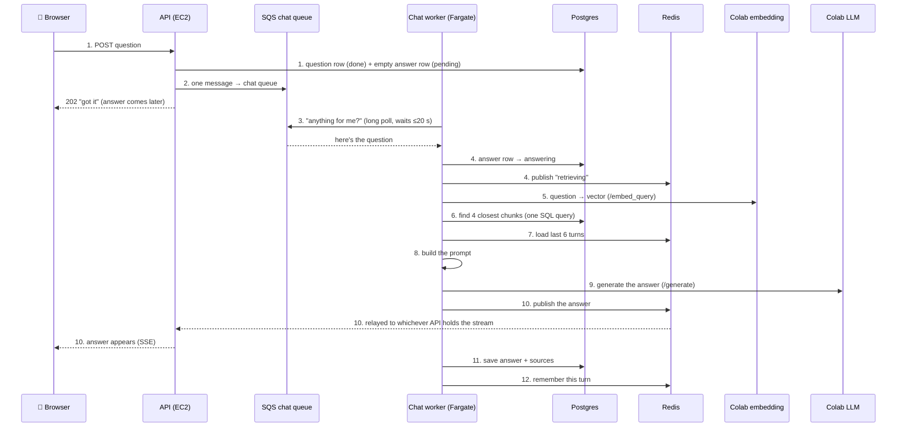

# Guide 2: Chat — how a question becomes an answer

> **Chat** = everything between "user presses Send" and "the answer appears".
> It only works once ingestion (Guide 1) has made the session `ready`.
>
> The idea in one sentence: **turn the question into numbers, find the 4
> chunks with the closest numbers, and give those chunks plus the question to
> the AI.** That is RAG (Retrieval-Augmented Generation).

---

## The flow diagram



**The same two questions as in ingestion:**

- **Who puts the message in the chat queue?** The API, in step 2, right after saving the question.
- **How does the chat worker know?** It keeps asking SQS in a loop. Each ask waits up to 20 s and returns the instant a message lands (long polling).

**The big difference from ingestion:** chat has **no broker**. A person is
waiting, so the worker calls the Colab services **directly** over HTTP, using
the tunnel URLs pasted into the app's first screen.

---

## The whole flow, one line per step

```
 1. Browser sends the question            → POST /sessions/{id}/chat        (routes/chat.py)
 2. API puts 1 message in the chat queue  → SQS chat queue                  (shared/queues.py send)
 3. Chat worker asks queue, gets message  → long poll ReceiveMessage        (shared/worker.py)
 4. Worker marks the answer "answering"   → Postgres + live event           (workers/chat/main.py)
 5. Question turned into a vector         → Colab /embed_query              (shared/clients.py)
 6. Closest 4 chunks found                → one SQL query, pgvector         (shared/vectorstore.py)
 7. Recent conversation loaded            → Redis, last 6 turns             (shared/events.py)
 8. Prompt built                          → instructions + chunks + history (workers/chat/main.py)
 9. AI writes the answer                  → Colab /generate                 (shared/clients.py)
10. Answer sent to the browser live       → Redis pub/sub → SSE             (routes/events.py)
11. Answer saved to the database          → messages table, with sources    (workers/chat/main.py)
12. Turn remembered for next question     → Redis history                   (shared/events.py)
```

**The three versions in one line each:**

- **v1:** the API ran the answer in a background thread, and the browser polled every 2 s.
- **v2:** a chat queue + chat worker on the same EC2 box. Vectors were searched **in Chroma on Colab**.
- **v3:** the chat worker on Fargate. Vectors are searched **in our own Postgres**, plus login.

---

## Step 1 — The browser sends the question

📍 **You are here:** `[Browser] ──▶ [API] ──▶ Postgres` · diagram arrow **1**

### 🟢 Newbie

- **What happens:** you type a question and press Send. The API saves it and answers "got it" right away. It does **not** wait for the answer.
- **Which code:** `backend/api/routes/chat.py` → `post_message()`
- **Why it doesn't wait:** the AI can take 10–60 seconds. If the API waited, every waiting question would tie up the server.
- **What if we skip it:** nothing gets asked.
- **What you get:** a `message_id` for the answer that is on its way.

### 🔧 Technical

- Checks: the session exists (404), you own it (403), and it is `ready` (409 "nothing indexed yet").
- Inserts **two** `messages` rows:
  - the question (`role=user`, `done`)
  - an empty answer (`role=assistant`, `pending`)
- Returns `202 Accepted` (after step 2).

### 🔁 Compared with v2

- **What v2 did:** the same two rows and a `202`, but with **no ownership check**.
- ✅ **v3 is better:** you can't post questions into, or read, someone else's session.
- ❌ **v3 is worse:** you need a valid sign-in token on every call.

### ⏪ Compared with v1

- **What v1 did:** the same two rows and the same 4000-character limit, as a sync `def`, with no ownership check.
- ✅ **v3 is better:**
  - Ownership checks.
  - The API is async, so it isn't holding a thread per request.
- ❌ **v3 is worse:** nothing, for this step.

---

## Step 2 — The API puts one message in the chat queue  *(who fills the queue)*

📍 **You are here:** `[API] ──▶ [SQS chat queue]` · diagram arrow **2**

### 🟢 Newbie

- **What happens:** the API writes one note, "answer message X for session Y, the question is …", into the **chat queue**, then returns.
- **Which code:** `post_message()` → `queues.send(settings.chat_queue_url, …)`
- **Why a separate chat queue:** if chat shared the ingest queue, someone's 50-file upload would sit **in front of** everyone's questions.
- **What if we skip it:** the question is saved but nobody ever answers it.
- **What you get:** 1 message in `edgentrag-v3-chat`.

### 🔧 Technical

- Body: `{session_id, message_id, question}`.
- Sent via `run_in_threadpool`, because boto3 is synchronous.
- The chat queue has its own DLQ (5 tries), like the ingest queue.

### 🔁 Compared with v2

- **What v2 did:** exactly the same.
- ✅ **v3 is better:** nothing changed. The queue is just the new `edgentrag-v3-chat`.
- ❌ **v3 is worse:** nothing.

### ⏪ Compared with v1

- **What v1 did:** no queue. It called `background.add_task(chat_pipeline.answer, …)`, which ran the answer **inside the API process**.
- ✅ **v3 is better:**
  - **An API restart doesn't lose the question.** In v1 the answer row stayed `pending` forever.
  - A failed answer is **retried**.
- ❌ **v3 is worse:** a queue and a worker just to answer one question. v1 was one function call.

---

## Step 3 — The chat worker asks the queue and gets the message  *(how the worker knows)*

📍 **You are here:** `[Chat worker] ──"anything?"──▶ [SQS chat queue] ──message──▶ [Chat worker]` · diagram arrow **3**

### 🟢 Newbie

- **What happens:** the **chat worker** (its own small program on ECS Fargate) runs a loop asking the chat queue "anything for me?". Each ask waits up to 20 s and returns **as soon as** your question lands.
- **Which code:** `shared/worker.py` → `Worker`, which calls `workers/chat/main.py` → `handle()`
- **Why a separate chat worker:** it's tiny (116 MB vs 3.4 GB for ingest), so it starts fast and scales fast. That matters when someone is waiting.
- **What if it's not running:** questions stay `pending` until it comes back. They aren't lost.
- **What you get:** the question is now being worked on.

### 🔧 Technical

- Same consume loop as ingest (long poll, invisible for 900 s, delete on success).
- Its heartbeat is **30 s** instead of 60 s. A question should never take minutes, so if one stalls it should go back to the queue sooner.
- If the message is already `done` (delivered twice) → it's skipped.
- Autoscaling: min 1, max 2, target 2 messages per task.

### 🔁 Compared with v2

- **What v2 did:** the same loop, but as a **container on the one EC2 box**, built from the **same image as the ingest worker** (Docling included).
- ✅ **v3 is better:**
  - A 116 MB image instead of a 3.4 GB one, so it starts much faster.
  - It doesn't share CPU with the API or with PDF conversion.
  - It autoscales.
- ❌ **v3 is worse:**
  - At least one Fargate task always running, even at 3 a.m., and it costs money.
  - One more service to deploy.

### ⏪ Compared with v1

- **What v1 did:** no worker. The API's own background thread did the work.
- ✅ **v3 is better:** answering can't slow the website down, and it survives crashes.
- ❌ **v3 is worse:** there's a lot more infrastructure behind "answer a question".

---

## Step 4 — The worker marks the answer "answering"

📍 **You are here:** `[Chat worker] ──▶ Postgres (answering) + Redis ("retrieving") ──▶ Browser` · diagram arrow **4**

### 🟢 Newbie

- **What happens:** the answer row changes to `answering`, and the browser shows "retrieving…".
- **Which code:** `workers/chat/main.py` → `handle()` + `_announce()`
- **Why we need it:** so you know something is happening.
- **What if we skip it:** the screen looks frozen until the answer suddenly appears.
- **What you get:** a live "retrieving" status.

### 🔧 Technical

- `row.status = "answering"`, then commit.
- `events.publish(... {"event":"message","stage":"retrieving"})` goes out through Redis to SSE.

### 🔁 Compared with v2

- **What v2 did:** exactly the same.
- ✅ **v3 is better:** only the owner's stream receives it, thanks to the ticket.
- ❌ **v3 is worse:** nothing.

### ⏪ Compared with v1

- **What v1 did:** it set `answering` in the database only. The browser found out on its next 2-second poll.
- ✅ **v3 is better:** it shows up instantly.
- ❌ **v3 is worse:** it needs Redis plus an SSE stream. v1 needed nothing.

---

## Step 5 — The question is turned into a vector

📍 **You are here:** `[Chat worker] ──HTTP──▶ [Colab embedding /embed_query] ──vector──▶ [Chat worker]` · diagram arrow **5**

### 🟢 Newbie

- **What happens:** the question is sent to the Colab embedding service, which turns it into 384 numbers, **with the same model used for the documents**.
- **Which code:** `shared/clients.py` → `embed_query()` → Colab `services/embedding/app.py` → `/embed_query`
- **Why we need it:** to compare the question with the chunks, both must be numbers from the same model.
- **Why a direct call (not the broker):** a person is waiting, and this takes milliseconds.
- **What you get:** one vector for your question.

### 🔧 Technical

- A direct `POST {embedding_url}/embed_query {"query": …}` → `{"vector": [384 floats]}`.
- The URL is read from Redis on **every** call (`shared/services.py`), so a restarted Colab works as soon as you paste its new URL.
- Built-in safety:
  - a timeout
  - 3 retries with growing waits
  - a **circuit breaker**: after 5 failures in a row it stops calling for 30 s
- A 4xx response is not retried, because the request itself is wrong.

### 🔁 Compared with v2

- **What v2 did:** called **`/retrieve`**, which embedded the question **and searched Chroma** on Colab in one go, returning chunk keys and scores.
- ✅ **v3 is better:**
  - Colab only does the one thing that needs its model. The search moves home (step 6).
  - A tiny, simple endpoint.
- ❌ **v3 is worse:**
  - **Chat still stops if Colab is down**, since the question can't be embedded. Same as v2.
  - A new endpoint had to be added to the Colab service.

### ⏪ Compared with v1

- **What v1 did:** the same `/retrieve` call as v2, but with **no retries, no timeout handling and no circuit breaker**. The docstring says: *"If a service is down, these raise."*
- ✅ **v3 is better:**
  - A Colab blip is retried.
  - A dead Colab gets a clean "unavailable" instead of hammering it.
- ❌ **v3 is worse:** nothing, for this step.

---

## Step 6 — The closest 4 chunks are found

📍 **You are here:** `[Chat worker] ──SQL──▶ [Postgres + pgvector] ──4 chunks──▶ [Chat worker]` · diagram arrow **6**

### 🟢 Newbie

- **What happens:** Postgres compares your question's numbers with every chunk's numbers **in this session** and returns the 4 most similar, **text included**.
- **Which code:** `shared/vectorstore.py` → `search()`
- **Why we need it:** the AI can't read all your documents at once. We give it only the most relevant pieces.
- **If retrieval is bad:** the AI gets the wrong pieces and gives a wrong answer, even though the AI itself is fine. **Most wrong answers start here.**
- **What you get:** 4 chunks, each with text, source filename, section and a score (0–1, higher = closer).

### 🔧 Technical

```sql
SELECT chunk_key, source, section, text, embedding <=> :q AS distance
FROM chunks
WHERE session_id = :sid AND embedding IS NOT NULL
ORDER BY distance LIMIT 4;
```

- `<=>` is pgvector's cosine distance, and `score = 1 - distance`. It uses the HNSW index.
- `embedding IS NOT NULL` skips chunks whose vectors haven't arrived yet.
- `top_k=4` is set in `shared/config.py`.
- Your uncommitted change logs every retrieved chunk and its score, and warns when retrieval returns nothing. Check the chat worker's logs when an answer is wrong.

### 🔁 Compared with v2

- **What v2 did:** **two steps.**
  - `/retrieve` on Colab (Chroma) returned *which* chunks.
  - A second query to **our** database fetched *what* was in them, by key.
  - Then an **orphan check**: "vector exists but text is missing" was possible.
- ✅ **v3 is better:**
  - **One query**: vector and text are in the same row, so an orphan can't happen.
  - **The index survives Colab restarts.** In v2, a recycled Colab runtime wiped Chroma, and every old session quietly returned **nothing**.
  - The vectors are backed up with RDS.
- ❌ **v3 is worse:**
  - Vector search now uses the **small RDS instance's** CPU (`db.t4g.micro`). At scale that could be slower than Chroma on a GPU box.
  - The embedding size is locked into the schema (384).

### ⏪ Compared with v1

- **What v1 did:**
  - `/retrieve` returned hits pointing at **files**.
  - `fetch_chunks()` then **downloaded whole `.jsonl` chunk files from S3** and scanned them for the matching ids, once per file per question.
- ✅ **v3 is better:** there's no file downloading per question, and there's no "hit pointing at nowhere".
- ❌ **v3 is worse:** it needs pgvector, migrations and a real Postgres. v1 needed only files.

---

## Step 7 — The recent conversation is loaded

📍 **You are here:** `[Chat worker] ──▶ [Redis chat:{session}] ──last 6 turns──▶ [Chat worker]` · diagram arrow **7**

### 🟢 Newbie

- **What happens:** the last few questions and answers of this chat are fetched from Redis.
- **Which code:** `shared/events.py` → `history()`
- **Why we need it:** so follow-ups like "tell me more about that" make sense.
- **What if we skip it:** every question is treated as brand new, and "that" means nothing.
- **What you get:** up to 6 previous question/answer pairs.

### 🔧 Technical

- A Redis list `chat:{session_id}`, trimmed to 12 entries (6 turns), expiring after 24 h.
- It's a short-term memory. The full record is in the `messages` table.

### 🔁 Compared with v2

- **What v2 did:** the same Redis list, but Redis was a container with **no persistence** (`--save ""`) on the same box.
- ✅ **v3 is better:** managed ElastiCache with encryption, shared by every worker and API server.
- ❌ **v3 is worse:** ElastiCache costs money even when idle.

### ⏪ Compared with v1

- **What v1 did:** on EC2, a **Python dictionary inside the API process** (`MEMORY_BACKEND=memory`).
  - It was lost on every restart.
  - It couldn't be shared if there were ever two processes.
- ✅ **v3 is better:** the memory survives restarts, and every worker sees the same history.
- ❌ **v3 is worse:** a dictionary needs zero setup. Redis doesn't.

---

## Step 8 — The prompt is built

📍 **You are here:** `[Chat worker: build_prompt()]` (nothing leaves the worker) · diagram arrow **8**

### 🟢 Newbie

- **What happens:** one big block of text is put together for the AI, containing:
  - the rules ("only use the context, say so if you don't know")
  - the 4 numbered chunks
  - the recent chat
  - your question
- **Which code:** `workers/chat/main.py` → `build_prompt()`
- **Why we need it:** the AI only knows what we put in front of it.
- **What if we skip the rules:** the AI makes up answers from its general knowledge.
- **What you get:** the final prompt text.

### 🔧 Technical

```
<SYSTEM_INSTRUCTIONS>

Context:
[1] (report.pdf - Intro > Goals)
<chunk text>
[2] ...

Recent conversation:
User: ...
Assistant: ...

User: <question>
Assistant:
```

- If there are no chunks → `Context: nothing relevant was found in the documents.`

### 🔁 Compared with v2

- **What v2 did:** **exactly the same function**, word for word.
- ✅ **v3 is better:** nothing changed.
- ❌ **v3 is worse:** it's no better either. Answer quality is identical, because v3 changed *where things run*, not *how well it answers*.

### ⏪ Compared with v1

- **What v1 did:** the same function, the same instructions, the same format.
- ✅ / ❌ **No difference.** This is the one part that never changed across all three versions.

---

## Step 9 — The AI writes the answer

📍 **You are here:** `[Chat worker] ──HTTP──▶ [Colab LLM /generate] ──answer──▶ [Chat worker]` · diagram arrow **9**

### 🟢 Newbie

- **What happens:** the prompt goes to the language model on the Colab GPU (TinyLlama by default), which writes the answer.
- **Which code:** `shared/clients.py` → `generate()` → Colab `services/llm/app.py` → `/generate`
- **Why a direct call, not a queue:** a person is waiting, so speed matters most.
- **What if Colab is down:** after retries the answer is marked `failed` with the error, and the message goes back to the queue for another try.
- **What you get:** the answer text.

### 🔧 Technical

- `POST {llm_url}/generate {prompt, max_new_tokens: 400, temperature: 0.3}` → `{content, usage}`.
- The same retry and circuit-breaker logic as step 5.
- It returns the whole answer at once. There is no token-by-token streaming yet, but the plumbing for it is ready.

### 🔁 Compared with v2

- **What v2 did:** the same call, with the same retries and breaker.
- ✅ **v3 is better:** nothing changed.
- ❌ **v3 is worse:** nothing. It's also no faster: the GPU is still one Colab runtime, and that is the real limit.

### ⏪ Compared with v1

- **What v1 did:** a plain `requests.post`, with **no retry and no breaker**.
- ✅ **v3 is better:** a brief tunnel hiccup no longer fails the answer.
- ❌ **v3 is worse:** nothing.

---

## Step 10 — The answer is sent to the browser live

📍 **You are here:** `[Chat worker] ──publish──▶ [Redis] ──▶ [API holding your stream] ──SSE──▶ [Browser]` · diagram arrow **10**

### 🟢 Newbie

- **What happens:** the answer is sent over the same live channel as the progress updates, so it appears without a refresh.
- **Which code:**
  - `workers/chat/main.py` → `publish_token()`
  - The browser receives it in `frontend/src/useSessionEvents.js`
- **Why we need it:** you see the answer the moment it's ready.
- **What if you weren't connected:** nothing is lost. The browser reloads it from the database (step 11).
- **What you get:** the answer on screen.

### 🔧 Technical

- A `token` event is published to `events:{session_id}`. The browser **appends** the text to that message.
- Today there's one token event holding the whole answer. With streaming it would be many small ones, and no other code would change.

### 🔁 Compared with v2

- **What v2 did:** the same mechanism, with no stream auth.
- ✅ **v3 is better:** only the session's owner can receive the answer, thanks to tickets.
- ❌ **v3 is worse:** there are more ways for the stream to silently break (ALB idle timeout, CloudFront header forwarding).

### ⏪ Compared with v1

- **What v1 did:** nothing live. The browser saw the answer on its next `GET /chat` poll, which re-downloaded **the whole conversation** every 2 seconds.
- ✅ **v3 is better:** instant, and no re-downloading of the whole chat.
- ❌ **v3 is worse:** polling was simpler and worked everywhere.

---

## Step 11 — The answer is saved to the database

📍 **You are here:** `[Chat worker] ──▶ Postgres messages row (done + sources)` · diagram arrow **11**

### 🟢 Newbie

- **What happens:** the answer and its 4 sources are saved permanently.
- **Which code:** `workers/chat/main.py` → `handle()`
- **Why we need it:** the live channel is temporary, and the database is the real record.
- **What if we skip it:** a page reload loses the answer.
- **What you get:** the chat history, readable with `GET /sessions/{id}/chat`.

### 🔧 Technical

- `row.content`, `row.status="done"`, `row.sources=[…]` (a JSON column), then commit.
- Then a `message` event with `stage:"done"`, plus `usage` and `seconds`.
- **On any error:** it rolls back and marks the answer `failed` **unless it is already `done`**, then re-raises so SQS retries it.

### 🔁 Compared with v2

- **What v2 did:** the same save, but its error handler had **no "already done" guard**. An error *after* the save could replace a good answer with "Something went wrong".
- ✅ **v3 is better:** that bug is fixed, and RDS is backed up where SQLite wasn't.
- ❌ **v3 is worse:** nothing.

### ⏪ Compared with v1

- **What v1 did:** the same save. On error it marked the answer `failed` **with no retry**.
- ✅ **v3 is better:** failures are retried by the queue, up to 5 times.
- ❌ **v3 is worse:** a retried answer can briefly show "failed" and then flip to "done", which can confuse users.

---

## Step 12 — The turn is remembered for the next question

📍 **You are here:** `[Chat worker] ──▶ [Redis chat:{session}]` · diagram arrow **12**

### 🟢 Newbie

- **What happens:** this question and answer are added to the short-term memory used in step 7.
- **Which code:** `shared/events.py` → `push_turn()`
- **Why it happens last:** a question that got no answer shouldn't be remembered.
- **What if Redis fails here:** only a warning is logged. The answer is already saved, so it isn't affected.
- **What you get:** follow-up questions work.

### 🔧 Technical

- `RPUSH` + `LTRIM` + `EXPIRE` in one pipeline, wrapped in try/except so a Redis error never fails the job.

### 🔁 Compared with v2

- **What v2 did:** the same pipeline **without try/except**. A Redis blip here raised an exception *after* the answer was saved, and v2's error handler then **overwrote the good answer with a failure message**.
- ✅ **v3 is better:** a Redis problem now costs one turn of memory, not the answer.
- ❌ **v3 is worse:** nothing.

### ⏪ Compared with v1

- **What v1 did:** `memory.push` into the in-process dictionary, lost on restart.
- ✅ **v3 is better:** the memory is durable and shared.
- ❌ **v3 is worse:** it needs Redis.

---

## When an answer is wrong — where to look

- **Chat worker logs** (`/ecs/edgentrag-v3-chat`):
  - `retrieved N chunks … file#0003=0.612` → were these the right pieces?
  - `retrieved NOTHING` → the session has no vectors (check Guide 1, step 13).
- **Low scores** (below ~0.3) → the document probably doesn't contain the answer.
- **Right chunks, wrong answer** → look at the prompt or the model (step 8 or 9).
